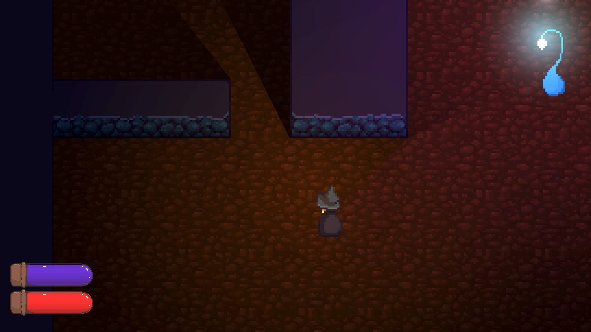

## A minimalistic example of a Löve "game" including:
- Use of common Löve and lua libraries
- Showing how to piece together an Entity Component System and gamestates
- Character movement
- Drawing system that supports z-index layers
- Drawing sprites
- Basic AI that follows the player character

The idea of this repo is to serve as a minimal but functional example on how to set up a game template using common patterns such as:

- Using an Entity Component System (ECS) for separating logic from data, with each part of the game handled in their corresponding systems
- Game state management (currently just switches to "ingame")
- Separate of concerns (thanks to the ECS)

Also features a media manager that loads your media into an atlas manager that you can query with hierarchical accessors like 'decals.bushes.purpleBush' based on the directory hierarchy.

Assemblages (functions that generate entities, usually giving them a bunch of predefined components) are loaded in a similar fashion and you can access them with selectors such as 'living.characters.player'.

#### Usage (requires love installed on your system)
```
git clone https://github.com/speakk/love_minimal_gameish
cd love_minimal_gameish
love ./
```

#### Libaries used
- Love (the actual game library) [https://love2d.org/](https://love2d.org/)
- Concord (Entity Component System lib) [https://github.com/Tjakka5/Concord](https://github.com/Tjakka5/Concord/)
- batteries (handy util functions) [https://github.com/1bardesign/batteries/](https://github.com/1bardesign/batteries/)
- hump (for gamestate and classes) [https://github.com/vrld/hump](https://github.com/vrld/hump/)
- brinevector (fast vector maths) [https://github.com/novemberisms/brinevector](https://github.com/novemberisms/brinevector)

If you have any questions or comments, feel free to pop by at the [official Love Discord server](https://discord.gg/rhUets9) and say hi.

#### A screenshot (that lil fella moves with w-a-s-d)


## Notes on how to think in terms of an ECS
When working on ECS components, it's funny how if you need a door for example, your first thought is often to make a component to tag it as "door", when really door is the concept (entity) that can be broken into its subparts, like "openable" and "physical" and "sprite", etc. So often when one needs a new kind of functionality, one needs to define just one system and add one component (because usually you'll already have your "sprite" and "physical" and such common systems already there, so those can be utilized to combine them into what now has all the aspects of making a functioning door. Then one can make anything behave like a door by tagging any entity with "openable".
